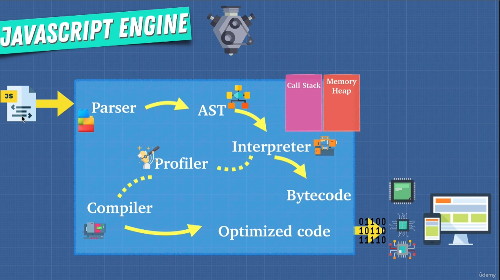

<video width="500" height="240" controls>
  <source src="./v8-engine.mp4" type="video/mp4">
</video>

## JavaScript Engine



### Parser

Parsing means analyzing and converting a program into an internal format that a runtime environment can actually run, for example the JavaScript engine inside browsers.

The browser parses HTML into a DOM tree. HTML parsing involves tokenization and tree construction. HTML tokens include start and end tags, as well as attribute names and values. If the document is well-formed, parsing it is straightforward and faster. The parser parses tokenized input into the document, building up the document tree.


When the browser encounters CSS styles, it parses the text into the CSS Object Model (or CSSOM), a data structure it then uses for styling layouts and painting. 

Parser knows the JavaScript rules and how it has to be written in order to be correct, to be valid. And if you make some mistakes, it basically throws an error and stops the execution.

If everything is correct though, then the parser produces a data structure known as the Abstract Syntax Tree, which is then translated into machine code. So this code is no longer JavaScript code, but a code, or let’s say a set of instructions, that can be executed directly by the computer’s processor. And it’s only when our code already converted to machine code, actually runs and does its work.

**@babel/parser** based on acorn, supports all new language features
shfit-ast parser produces Shift AST

**typescript** can parse JavaScript and TypeScript, producing it's own AST format for this

### AST

Abstract Syntax Tree (AST), is a tree representation of program source code.

JS Code:
```javascript
const test = 10;

function test2() {
 console.log(test)
}
```
AST:
```json
{
  "type": "Program",
  "start": 0,
  "end": 57,
  "body": [
    {
      "type": "VariableDeclaration",
      "start": 0,
      "end": 16,
      "declarations": [
        {
          "type": "VariableDeclarator",
          "start": 6,
          "end": 15,
          "id": {
            "type": "Identifier",
            "start": 6,
            "end": 10,
            "name": "test"
          },
          "init": {
            "type": "Literal",
            "start": 13,
            "end": 15,
            "value": 10,
            "raw": "10"
          }
        }
      ],
      "kind": "const"
    },
    {
      "type": "FunctionDeclaration",
      "start": 18,
      "end": 57,
      "id": {
        "type": "Identifier",
        "start": 27,
        "end": 32,
        "name": "test2"
      },
      "expression": false,
      "generator": false,
      "async": false,
      "params": [],
      "body": {
        "type": "BlockStatement",
        "start": 35,
        "end": 57,
        "body": [
          {
            "type": "ExpressionStatement",
            "start": 38,
            "end": 55,
            "expression": {
              "type": "CallExpression",
              "start": 38,
              "end": 55,
              "callee": {
                "type": "MemberExpression",
                "start": 38,
                "end": 49,
                "object": {
                  "type": "Identifier",
                  "start": 38,
                  "end": 45,
                  "name": "console"
                },
                "property": {
                  "type": "Identifier",
                  "start": 46,
                  "end": 49,
                  "name": "log"
                },
                "computed": false,
                "optional": false
              },
              "arguments": [
                {
                  "type": "Identifier",
                  "start": 50,
                  "end": 54,
                  "name": "test"
                }
              ],
              "optional": false
            }
          }
        ]
      }
    }
  ],
  "sourceType": "module"
}
```

**estree** - standard for EcmaScript AST;

**shift** - was designed with transformation in mind, not compatible with estree;

**babel** - supports language features which is have not yet become a standard, but have a proposal.

### Interpreter

### Compiler